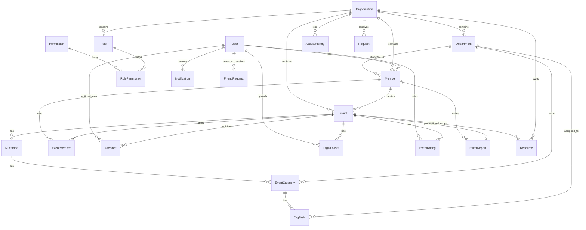

# DOMAIN_ENTITY_LOCK_V1

## 1. Purpose

Đây là tài liệu khóa domain trước khi viết bất kỳ entity code, DbContext, EF configuration hay migration nào cho Phase 3B.

Mục tiêu của tài liệu này là chốt rõ:

- entity nào có trong database v1;
- entity nào là bắt buộc cho core flow;
- entity nào được phép có trong DB nhưng chưa có UI/API working;
- entity nào bị loại khỏi v1;
- field, quan hệ, enum, delete behavior, index và unique constraint phải đi theo một thiết kế thống nhất.

## 2. Source of Truth

Tài liệu này được ưu tiên theo thứ tự sau:

1. `PBL3_SYSTEM_DESIGN_AND_PROTOTYPE_HANDOFF_FINAL_CLEAN.md` - blueprint cao nhất.
2. Audit facts: `PBL3-refactor/Docs/00_AUDIT_INDEX.md`, `02_BACKEND_FACTS.md`, `05_BE_FE_MAPPING_FACTS.md`, `06_MODULE_FACTS.md`, `07_UNKNOWN_AND_UNVERIFIED.md`.
3. `PHASE_3A_REPO_FOUNDATION_REPORT.md` - xác nhận nền đã tạo xong.
4. `PHASE_3_SCOPE_LOCK.md`, `DO_NOT_IMPLEMENT_YET.md`, `REPO_STRUCTURE_LOCK.md` - khóa phạm vi và cấu trúc repo.
5. `NEXT_PHASE_INPUT.md` - chỉ là input starter, đã được hiệu chỉnh lại để không bị giản lược quá mức.

## 3. Scope Classification

### 3.1 MUST_HAVE_DB_V1

| Entity | Lý do |
|---|---|
| BaseEntity | Nền soft-delete + audit timestamp cho toàn bộ business entity. |
| User | Auth, hồ sơ, tham gia tổ chức, attendee, notification, friend flow. |
| Organization | Root aggregate của mọi workspace. |
| Member | Membership của user trong organization. |
| Role | Role tùy chỉnh trong organization. |
| Permission | Permission key theo module. |
| RolePermission | Mapping role-permission. |
| Department | Phòng ban/ban trong organization. |
| Event | Aggregate sự kiện. |
| EventMember | Staff/organizer nội bộ của event. |
| Attendee | Người tham dự/đăng ký/check-in sự kiện. |
| Milestone | Nhánh con của event cho planning. |
| EventCategory | Hạng mục trong milestone. |
| OrgTask | Task của hạng mục. |
| Request | Request join/review workflow. |
| Notification | In-app notification. |
| FriendRequest | Kết bạn giữa user. |

### 3.2 SHOULD_HAVE_DB_V1_NO_WORKING_UI_YET

| Entity | Lý do |
|---|---|
| DigitalAsset | Audit xác nhận có entity; chưa có API/UI working. |
| EventRating | Cần cho rating thống kê, chưa có UI working. |
| EventReport | Có thể tồn tại trong DB nhưng chưa có report UI/API working. |
| Resource | Có entity hợp lệ, chưa có BE endpoint working. |
| ActivityHistory | Có entity hợp lệ, chưa có UI/API working. |

### 3.3 EXCLUDED_FROM_DB_V1

| Entity / Family | Lý do |
|---|---|
| OrganizationPost | Posts bị hard-excluded khỏi rescue v1. |
| PostComment | Posts/Comments bị hard-excluded. |
| Message, ChatThread | Messages/Chat chỉ prototype-only, không thiết kế DB working ở v1. |
| Finance-specific ledger/payment/budget entities | Prototype-only, chưa đủ contract để đưa vào v1. |

## 4. Core Domain Chain

Chuỗi domain cốt lõi vẫn là:

`Organization → Member → Event → Milestone → EventCategory → OrgTask`

Điều này có nghĩa:

- `Organization` là aggregate root của workspace.
- `Member` là membership của user trong organization, dùng cho access, role, department và task ownership.
- `Event` là aggregate của sự kiện trong một organization.
- `Milestone` chia `Event` thành các chặng.
- `EventCategory` chia milestone thành các hạng mục.
- `OrgTask` nằm dưới `EventCategory`, không nằm trực tiếp dưới `Event`.

Phân biệt bắt buộc:

- `Member` = user tham gia organization.
- `EventMember` = staff/organizer nội bộ của event.
- `Attendee` = người tham dự/đăng ký/check-in event.
- `OrgTask` = task theo hạng mục trong event tree, không phải task board theo organization.

`/org/tasks` aggregate board chỉ là PROTOTYPE_ONLY và không được biến thành một concept DB độc lập trong v1.

## 5. Entity Relationship Overview

## 6. Entity Specifications

### 6.1 BaseEntity

- Purpose: nền chung cho audit timestamp và soft-delete.
- Scope status: MUST_HAVE_DB_V1.
- Fields: `Id`, `CreatedAt`, `UpdatedAt?`, `IsDeleted`, `DeletedAt?`.
- Required / nullable: `Id`, `CreatedAt`, `IsDeleted` required; `UpdatedAt`, `DeletedAt` nullable.
- Navigation: none.
- Indexes / unique: none.
- Delete behavior: n/a.
- Notes / risk: toàn bộ business entity bình thường inherit từ đây; `RolePermission` không inherit.
- DbContext: không có DbSet riêng.
- UI/API working: không.

### 6.2 User

- Purpose: tài khoản người dùng, auth profile, nguồn của membership, attendee, notification và friend flow.
- Scope status: MUST_HAVE_DB_V1.
- Fields: `FullName`, `Email`, `PasswordHash`, `PhoneNumber?`, `Dob?`, `Gender?`, `Address?`, `AvatarUrl?`, `Bio?`, `SocialLinks?`, `Status`, `ProfileVisibility?`, `LastLoginAt?`, `EmailConfirmed`.
- Required / nullable: bắt buộc `FullName`, `Email`, `PasswordHash`, `Status`, `EmailConfirmed`; còn lại nullable hoặc có default.
- Navigation: `Members`, `SentFriendRequests`, `ReceivedFriendRequests`, `NotificationsReceived`, `NotificationsActedAsActor`, `Attendees`, `EventRatings`, `UploadedDigitalAssets`.
- Indexes / unique: unique `Email`; index `Status`.
- Delete behavior: các FK từ entity khác về `User` nên ưu tiên `Restrict/NoAction`, riêng các FK nullable như `Notification.ActorId`, `Attendee.UserId`, `DigitalAsset.UploadedByUserId` có thể `SetNull`.
- Notes / risk: không lưu raw password; `SocialLinks` nên là JSONB; `ProfileVisibility` có thể default `Public`.
- DbContext: có.
- UI/API working: yes.

### 6.3 Organization

- Purpose: aggregate gốc của workspace tổ chức.
- Scope status: MUST_HAVE_DB_V1.
- Fields: `OrgName`, `Description?`, `AvatarUrl?`, `CoverUrl?`, `FoundingDate?`, `Location?`, `ContactEmail?`, `ContactPhone?`, `TotalMembers`, `Status`, `CreatedByUserId?`.
- Required / nullable: bắt buộc `OrgName`, `TotalMembers`, `Status`; `TotalMembers` default `0`.
- Navigation: `CreatedByUser?`, `Members`, `Departments`, `Roles`, `Events`, `Requests`, `Resources`, `ActivityHistories`.
- Indexes / unique: index `Status`; unique `OrgName` theo hướng normalized/case-insensitive là ưu tiên, nhưng cần xác nhận chiến lược triển khai PostgreSQL trước migration.
- Delete behavior: mọi aggregate con chính nên `Restrict/NoAction`; `CreatedByUserId` nullable có thể `SetNull`.
- Notes / risk: `TotalMembers` là cached count, không phải truth source; `Posts` không được thêm vào rescue v1.
- DbContext: có.
- UI/API working: yes.

### 6.4 Member

- Purpose: membership của user trong organization, là điểm nối cho org access, department và role.
- Scope status: MUST_HAVE_DB_V1.
- Fields: `UserId`, `OrgId`, `DepartmentId?`, `RoleId?`, `JoinDate`, `Status`, `StudentCode?`.
- Required / nullable: bắt buộc `UserId`, `OrgId`, `JoinDate`, `Status`; các FK còn lại nullable.
- Navigation: `User`, `Organization`, `Department?`, `Role?`, `ManagedDepartments`, `AssignedTasks`, `CreatedTasks`, `EventMemberships`, `ReviewedRequests`.
- Indexes / unique: unique `(UserId, OrgId)`; index `OrgId`, `DepartmentId`, `RoleId`.
- Delete behavior: `User -> Member` và `Organization -> Member` nên `Restrict/NoAction`; `DepartmentId` và `RoleId` nullable có thể `SetNull` theo service-side soft-delete.
- Notes / risk: dùng `MemberStatus` thay vì `IsActive` để tránh mơ hồ; `RoleId` là canonical org-role link, không dựa vào fake frontend role GUID.
- DbContext: có.
- UI/API working: yes.

### 6.5 Role

- Purpose: role tùy chỉnh trong organization.
- Scope status: MUST_HAVE_DB_V1.
- Fields: `OrgId`, `RoleName`, `Description?`, `IsDefault`, `Level?`.
- Required / nullable: bắt buộc `OrgId`, `RoleName`, `IsDefault`; `Level` nullable.
- Navigation: `Organization`, `Members`, `RolePermissions`.
- Indexes / unique: unique `(OrgId, RoleName)`; index `OrgId`.
- Delete behavior: `Organization -> Role` nên `Restrict/NoAction`; `Role -> RolePermission` có thể `Cascade` vì là mapping table thuần.
- Notes / risk: `Level` dùng để giữ hierarchy canonical khi cần; seed canonical roles sẽ làm sau, không nằm ở Phase 3B.1.
- DbContext: có.
- UI/API working: yes.

### 6.6 Permission

- Purpose: permission key cho authorization theo module.
- Scope status: MUST_HAVE_DB_V1.
- Fields: `PermissionKey`, `DisplayName`, `ModuleGroup`, `Description?`.
- Required / nullable: bắt buộc `PermissionKey`, `DisplayName`, `ModuleGroup`.
- Navigation: `RolePermissions`.
- Indexes / unique: unique `PermissionKey`; index `ModuleGroup`.
- Delete behavior: `Permission -> RolePermission` có thể `Cascade`.
- Notes / risk: permission keys tối thiểu phải có `org.overview.read`, `org.overview.write`, `org.workspace.access`, `org.members.manage`, `org.roles.view`, `org.roles.create`, `org.roles.update`, `org.roles.delete`, `org.roles.assign`, `org.events.create`, `org.events.manage`, `org.departments.manage`, `org.requests.view`, `org.requests.review`, `org.requests.approve`.
- DbContext: có.
- UI/API working: yes.

### 6.7 RolePermission

- Purpose: mapping bảng nối role và permission.
- Scope status: MUST_HAVE_DB_V1.
- Fields: `RoleId`, `PermissionId`.
- Required / nullable: cả hai FK đều bắt buộc.
- Navigation: `Role`, `Permission`.
- Indexes / unique: composite primary key `(RoleId, PermissionId)`.
- Delete behavior: `Role -> RolePermission` `Cascade`; `Permission -> RolePermission` `Cascade`.
- Notes / risk: không inherit `BaseEntity`; đây là pure join table.
- DbContext: có.
- UI/API working: yes.

### 6.8 Department

- Purpose: phòng ban/ban trong organization, có manager và phân công task.
- Scope status: MUST_HAVE_DB_V1.
- Fields: `OrgId`, `DeptName`, `Code?`, `Function?`, `ManagerId?`, `Status`.
- Required / nullable: bắt buộc `OrgId`, `DeptName`, `Status`; `ManagerId` nullable và FK tới `Member`.
- Navigation: `Organization`, `Manager?`, `Members`, `OwnedCategories`, `AssignedTasks`.
- Indexes / unique: index `OrgId`, `ManagerId`; unique `(OrgId, Code)` nếu `Code` có giá trị, dùng partial unique index hoặc null-normalization để tránh vấn đề PostgreSQL với giá trị rỗng.
- Delete behavior: `Organization -> Department` `Restrict/NoAction`; `Department.ManagerId -> Member` `SetNull`; `Member.DepartmentId` cũng `SetNull`.
- Notes / risk: manager phải trỏ tới `Member`, không trỏ `User`.
- DbContext: có.
- UI/API working: yes.

### 6.9 Event

- Purpose: aggregate sự kiện của organization.
- Scope status: MUST_HAVE_DB_V1.
- Fields: `OrgId`, `EventName`, `Description?`, `StartDate`, `EndDate`, `Budget?`, `Location?`, `TargetParticipants?`, `Tags?`, `Status`, `Visibility`, `AverageRating?`, `CreatedByMemberId?`.
- Required / nullable: bắt buộc `OrgId`, `EventName`, `StartDate`, `EndDate`, `Status`, `Visibility`; `Budget` là decimal nullable.
- Navigation: `Organization`, `CreatedByMember?`, `Milestones`, `EventMembers`, `Attendees`, `DigitalAssets`, `EventRatings`, `EventReport`, `Resources`.
- Indexes / unique: index `OrgId`, `Status`, `Visibility`, `StartDate`.
- Delete behavior: `Organization -> Event` `Restrict/NoAction`; `Event -> Milestone` `Restrict/NoAction`; `Event -> EventMember` `Restrict/NoAction`; `Event -> Attendee` `Restrict/NoAction`; `Event -> DigitalAsset` `Restrict/NoAction`; `Event -> EventRating` `Restrict/NoAction`; `Event -> EventReport` `Restrict/NoAction`; `Event -> Resource` `SetNull` cho FK nullable.
- Notes / risk: task path phải đi qua milestone/category/task; `AverageRating` là cached value, không phải truth source.
- DbContext: có.
- UI/API working: yes.

### 6.10 EventMember

- Purpose: staff/organizer nội bộ của event.
- Scope status: MUST_HAVE_DB_V1.
- Fields: `EventId`, `MemberId`, `EventRole`, `AssignedAt`, `Note?`.
- Required / nullable: bắt buộc `EventId`, `MemberId`, `EventRole`, `AssignedAt`.
- Navigation: `Event`, `Member`.
- Indexes / unique: unique `(EventId, MemberId)`; index `MemberId`, `EventRole`.
- Delete behavior: `Event -> EventMember` `Restrict/NoAction`; `Member -> EventMember` `Restrict/NoAction`.
- Notes / risk: không dùng cho attendee/check-in; không tự thiết kế local event-permission override trong FE nếu API chưa trả `currentUserEventRole` hoặc tương đương.
- DbContext: có.
- UI/API working: no in base prototype; DB domain foundation only. EventMember is included in DB v1 to preserve event staff/organizer domain, but no working EventMember UI/API is required in base prototype.

### 6.11 Attendee

- Purpose: người tham dự/đăng ký/check-in event.
- Scope status: MUST_HAVE_DB_V1.
- Fields: `EventId`, `UserId?`, `GuestName?`, `GuestEmail?`, `GuestPhone?`, `Status`, `RegisteredAt`, `CheckedInAt?`, `Note?`.
- Required / nullable: bắt buộc `EventId`, `Status`, `RegisteredAt`; `UserId` nullable để hỗ trợ guest attendee.
- Navigation: `Event`, `User?`.
- Indexes / unique: index `EventId`, `UserId`; unique `(EventId, UserId)` khi `UserId` không null, nếu partial unique index gây phức tạp thì enforce service-level.
- Delete behavior: `Event -> Attendee` `Restrict/NoAction`; `User -> Attendee` `SetNull`.
- Notes / risk: UI có thể gắn nhãn Participant/Người tham dự, nhưng entity name phải là `Attendee`.
- DbContext: có.
- UI/API working: no in base prototype; DB domain foundation only. Attendee is included in DB v1 to preserve participant/registration/check-in domain, but no working Attendee UI/API is required in base prototype.

### 6.12 Milestone

- Purpose: phân chặng trong event.
- Scope status: MUST_HAVE_DB_V1.
- Fields: `EventId`, `Title`, `Description?`, `OrderIndex`, `StartDate?`, `EndDate?`, `Status`.
- Required / nullable: bắt buộc `EventId`, `Title`, `OrderIndex`, `Status`.
- Navigation: `Event`, `Categories`.
- Indexes / unique: index `EventId`; optional unique `(EventId, OrderIndex)`.
- Delete behavior: `Event -> Milestone` `Restrict/NoAction`; `Milestone -> EventCategory` `Restrict/NoAction`.
- Notes / risk: `OrderIndex` nên được giữ ổn định để render timeline/board.
- DbContext: có.
- UI/API working: yes.

### 6.13 EventCategory

- Purpose: hạng mục trong milestone để chứa task.
- Scope status: MUST_HAVE_DB_V1.
- Fields: `MilestoneId`, `CategoryName`, `Description?`, `OrderIndex`, `OwnerDepartmentId?`.
- Required / nullable: bắt buộc `MilestoneId`, `CategoryName`, `OrderIndex`; `OwnerDepartmentId` nullable.
- Navigation: `Milestone`, `OwnerDepartment?`, `Tasks`.
- Indexes / unique: index `MilestoneId`, `OwnerDepartmentId`; optional unique `(MilestoneId, OrderIndex)`.
- Delete behavior: `Milestone -> EventCategory` `Restrict/NoAction`; `Department -> EventCategory.OwnerDepartmentId` `SetNull`.
- Notes / risk: đây là bậc cha trực tiếp của task.
- DbContext: có.
- UI/API working: yes.

### 6.14 OrgTask

- Purpose: task của một hạng mục event.
- Scope status: MUST_HAVE_DB_V1.
- Fields: `EventCategoryId`, `TaskName`, `Description?`, `AssigneeId?`, `DeptId?`, `Priority`, `Deadline?`, `Status`, `Note?`, `CreatedByMemberId?`, `CompletedAt?`.
- Required / nullable: bắt buộc `EventCategoryId`, `TaskName`, `Priority`, `Status`; các FK còn lại nullable.
- Navigation: `EventCategory`, `Assignee?`, `Department?`, `CreatedByMember?`.
- Indexes / unique: index `EventCategoryId`, `AssigneeId`, `DeptId`, `Status`, `Deadline`.
- Delete behavior: `EventCategory -> OrgTask` `Restrict/NoAction`; `Member -> OrgTask.AssigneeId` `SetNull`; `Member -> OrgTask.CreatedByMemberId` `SetNull`; `Department -> OrgTask.DeptId` `SetNull`.
- Notes / risk: chỉ cho phép single assignee trong v1; không có multi-assignee table; không thiết kế list-by-org task như aggregate DB concept riêng.
- DbContext: có.
- UI/API working: yes.

### 6.15 Request

- Purpose: request join organization và workflow review.
- Scope status: MUST_HAVE_DB_V1.
- Fields: `SenderId`, `OrgId`, `RequestType`, `Title?`, `Content`, `DesiredDepartmentId?`, `DesiredPosition?`, `Status`, `ReviewNote?`, `ReviewedByMemberId?`, `ReviewedAt?`.
- Required / nullable: bắt buộc `SenderId`, `OrgId`, `RequestType`, `Content`, `Status`; còn lại nullable.
- Navigation: `Sender`, `Organization`, `DesiredDepartment?`, `ReviewedByMember?`.
- Indexes / unique: index `OrgId`, `SenderId`, `Status`, `RequestType`.
- Delete behavior: `User -> Request.SenderId` `Restrict/NoAction`; `Organization -> Request` `Restrict/NoAction`; `Department -> Request.DesiredDepartmentId` `SetNull`; `Member -> Request.ReviewedByMemberId` `SetNull`.
- Notes / risk: đây là nền cho join organization; các request type khác chỉ nên thêm khi DTO/API xác nhận.
- DbContext: có.
- UI/API working: yes.

### 6.16 Notification

- Purpose: notification in-app cho user.
- Scope status: MUST_HAVE_DB_V1.
- Fields: `ReceiverId`, `ActorId?`, `Title`, `Message`, `Type`, `RelatedEntityType?`, `RelatedEntityId?`, `ActionUrl?`, `IsRead`, `ReadAt?`.
- Required / nullable: bắt buộc `ReceiverId`, `Title`, `Message`, `Type`, `IsRead`; các field liên quan actor/target nullable.
- Navigation: `Receiver`, `Actor?`.
- Indexes / unique: index `(ReceiverId, IsRead)`, `CreatedAt`, `Type`.
- Delete behavior: `User -> Notification.ReceiverId` `Restrict/NoAction`; `User -> Notification.ActorId` `SetNull`.
- Notes / risk: `RelatedEntityType`/`RelatedEntityId` là polymorphic reference, nên giữ ở mức text + uuid, không ràng buộc FK cứng.
- DbContext: có.
- UI/API working: yes.

### 6.17 FriendRequest

- Purpose: kết bạn giữa user.
- Scope status: MUST_HAVE_DB_V1.
- Fields: `SenderId`, `ReceiverId`, `Status`, `RespondedAt?`.
- Required / nullable: bắt buộc `SenderId`, `ReceiverId`, `Status`.
- Navigation: `Sender`, `Receiver`.
- Indexes / unique: unique `(SenderId, ReceiverId)`; index `Status`.
- Delete behavior: `User -> FriendRequest.SenderId` và `User -> FriendRequest.ReceiverId` đều nên `Restrict/NoAction`.
- Notes / risk: `SenderId != ReceiverId` nên enforce ở validator/service, không cần DB check bắt buộc ở phase này.
- DbContext: có.
- UI/API working: yes.

### 6.18 DigitalAsset

- Purpose: file/asset được upload cho event.
- Scope status: SHOULD_HAVE_DB_V1_NO_WORKING_UI_YET.
- Fields: `EventId`, `FileName`, `FileUrl`, `FileType`, `UploadedByUserId?`, `UploadedAt`.
- Required / nullable: bắt buộc `EventId`, `FileName`, `FileUrl`, `FileType`, `UploadedAt`.
- Navigation: `Event`, `UploadedByUser?`.
- Indexes / unique: index `EventId`, `UploadedByUserId`, `FileType`.
- Delete behavior: `Event -> DigitalAsset` `Restrict/NoAction`; `User -> DigitalAsset.UploadedByUserId` `SetNull`.
- Notes / risk: có trong DB v1 nhưng không có working UI/API base prototype.
- DbContext: có.
- UI/API working: no.

### 6.19 EventRating

- Purpose: rating của user cho event, hỗ trợ cache `AverageRating`.
- Scope status: SHOULD_HAVE_DB_V1_NO_WORKING_UI_YET.
- Fields: `EventId`, `UserId`, `Rating`, `Aspect`, `Comment?`.
- Required / nullable: bắt buộc `EventId`, `UserId`, `Rating`, `Aspect`.
- Navigation: `Event`, `User`.
- Indexes / unique: index `EventId`, `UserId`; unique `(EventId, UserId, Aspect)` là ưu tiên nếu muốn một user chấm điểm theo từng khía cạnh chỉ một lần.
- Delete behavior: `Event -> EventRating` `Restrict/NoAction`; `User -> EventRating` `Restrict/NoAction`.
- Notes / risk: DB entity có thể tồn tại, nhưng không có EventRating UI/service working ở base prototype.
- DbContext: có.
- UI/API working: no.

### 6.20 EventReport

- Purpose: báo cáo tổng kết cho event.
- Scope status: SHOULD_HAVE_DB_V1_NO_WORKING_UI_YET.
- Fields: `EventId`, `ActualAttendance?`, `ActualBudget?`, `RatingAverage?`, `Summary?`, `CreatedByMemberId?`.
- Required / nullable: bắt buộc `EventId`; các trường còn lại nullable.
- Navigation: `Event`, `CreatedByMember?`.
- Indexes / unique: unique `EventId`; index `CreatedByMemberId` nếu cần truy vết.
- Delete behavior: `Event -> EventReport` `Restrict/NoAction`; `Member -> EventReport.CreatedByMemberId` `SetNull`.
- Notes / risk: one-to-one với Event; không có UI/API report working trong base prototype.
- DbContext: có.
- UI/API working: no.

### 6.21 Resource

- Purpose: tài nguyên của organization, có thể gắn với event.
- Scope status: SHOULD_HAVE_DB_V1_NO_WORKING_UI_YET.
- Fields: `OrgId`, `EventId?`, `ResourceName`, `Type?`, `Quantity`, `Status`, `Note?`.
- Required / nullable: bắt buộc `OrgId`, `ResourceName`, `Quantity`, `Status`; `EventId` nullable.
- Navigation: `Organization`, `Event?`.
- Indexes / unique: index `OrgId`, `EventId`, `Status`.
- Delete behavior: `Organization -> Resource` `Restrict/NoAction`; `Event -> Resource.EventId` `SetNull`.
- Notes / risk: có entity hợp lệ nhưng không có UI/API working ở base prototype.
- DbContext: có.
- UI/API working: no.

### 6.22 ActivityHistory

- Purpose: feed log hoạt động của organization.
- Scope status: SHOULD_HAVE_DB_V1_NO_WORKING_UI_YET.
- Fields: `OrgId`, `Title`, `Type`, `ReferenceId?`, `ReferenceType?`, `IsPublic`.
- Required / nullable: bắt buộc `OrgId`, `Title`, `Type`, `IsPublic`.
- Navigation: `Organization`.
- Indexes / unique: index `OrgId`, `Type`, `CreatedAt`; nếu cần filter public feed thì thêm composite index service-side sau.
- Delete behavior: `Organization -> ActivityHistory` `Restrict/NoAction`.
- Notes / risk: polymorphic reference nên để text + uuid, không ép FK cứng.
- DbContext: có.
- UI/API working: no.

## 7. Enum Specifications

Tất cả enum trong DB v1 nên lưu dưới dạng string để dễ đọc, dễ debug và an toàn khi thêm giá trị mới. Chỉ dùng int nếu sau này có lý do rõ ràng về hiệu năng hoặc tương thích legacy.

### 7.1 UserStatus

- Values: `Active`, `Inactive`, `Suspended`.
- Usage: trạng thái tài khoản user.
- Storage: string.

### 7.2 ProfileVisibility

- Values: `Public`, `OrganizationOnly`, `Private`.
- Usage: mức hiển thị profile.
- Storage: string.

### 7.3 OrgStatus

- Values: `Active`, `Suspended`, `Archived`.
- Usage: trạng thái organization.
- Storage: string.

### 7.4 MemberStatus

- Values: `Active`, `Invited`, `Suspended`, `Left`, `Removed`.
- Usage: lifecycle membership.
- Storage: string.

### 7.5 DepartmentStatus

- Values: `Active`, `Inactive`, `Archived`.
- Usage: trạng thái department.
- Storage: string.

### 7.6 MemberRole

- Values: `Member`, `Manager`, `VicePresident`, `President`.
- Usage: hierarchy canonical/default mapping, không phải role custom của `Role`.
- Storage: logic enum only trong v1; nếu sau này cần persist riêng thì dùng string.

### 7.7 EventStatus

- Values: `Draft`, `Published`, `Ongoing`, `Completed`, `Cancelled`, `Archived`.
- Usage: trạng thái sự kiện.
- Storage: string.

### 7.8 EventVisibility

- Values: `Public`, `OrganizationOnly`, `Private`.
- Usage: mức hiển thị event.
- Storage: string.

### 7.9 EventRole

- Values: `Manager`, `CoManager`, `Staff`, `Volunteer`, `Support`.
- Usage: vai trò staff nội bộ của `EventMember`.
- Storage: string.

### 7.10 AttendeeStatus

- Values: `Registered`, `CheckedIn`, `Cancelled`, `NoShow`, `Waitlisted`.
- Usage: trạng thái tham dự.
- Storage: string.

### 7.11 MilestoneStatus

- Values: `Planned`, `InProgress`, `Completed`, `Archived`.
- Usage: trạng thái milestone.
- Storage: string.

### 7.12 TaskStatus

- Values: `Todo`, `InProgress`, `Blocked`, `Done`, `Cancelled`.
- Usage: trạng thái task.
- Storage: string.

### 7.13 TaskPriority

- Values: `Low`, `Medium`, `High`, `Urgent`.
- Usage: mức ưu tiên task.
- Storage: string.

### 7.14 RequestType

- Values: `JoinOrganization`, `DepartmentChange`, `RoleChange`, `EventParticipation`, `Other`.
- Usage: loại request.
- Storage: string.

### 7.15 RequestStatus

- Values: `Pending`, `Approved`, `Rejected`, `Cancelled`, `Closed`.
- Usage: trạng thái review request.
- Storage: string.

### 7.16 NotificationType

- Values: `System`, `RequestSubmitted`, `RequestReviewed`, `FriendRequest`, `EventCreated`, `EventUpdated`, `EventReminder`, `TaskAssigned`, `TaskDue`, `ResourceChanged`.
- Usage: phân loại notification.
- Storage: string.

### 7.17 FriendRequestStatus

- Values: `Pending`, `Accepted`, `Rejected`, `Cancelled`, `Blocked`.
- Usage: trạng thái friend request.
- Storage: string.

### 7.18 FileType

- Values: `Image`, `Video`, `Audio`, `Document`, `Archive`, `Link`, `Other`.
- Usage: phân loại file của `DigitalAsset`.
- Storage: string.

### 7.19 RatingAspect

- Values: `Overall`, `Content`, `Logistics`, `Staff`, `Experience`.
- Usage: khía cạnh rating event.
- Storage: string.

### 7.20 ResourceStatus

- Values: `Available`, `Reserved`, `InUse`, `Maintenance`, `Unavailable`, `Lost`.
- Usage: trạng thái resource.
- Storage: string.

### 7.21 ActivityType

- Values: `OrganizationCreated`, `MemberJoined`, `MemberLeft`, `EventCreated`, `EventUpdated`, `MilestoneCreated`, `CategoryCreated`, `TaskCreated`, `TaskUpdated`, `RequestSubmitted`, `RequestReviewed`, `NotificationSent`, `ResourceAdded`, `ReportGenerated`, `RoleChanged`, `DepartmentUpdated`.
- Usage: loại activity feed log.
- Storage: string.

## 8. Delete Behavior Matrix

| Relationship | Recommended Delete Behavior |
|---|---|
| User -> Member | Restrict/NoAction |
| Organization -> Member | Restrict/NoAction |
| Organization -> Department | Restrict/NoAction |
| Organization -> Event | Restrict/NoAction |
| Organization -> Role | Restrict/NoAction |
| Role -> RolePermission | Cascade |
| Permission -> RolePermission | Cascade |
| Department.ManagerId -> Member | SetNull |
| Department -> Member.DepartmentId | SetNull |
| Event -> Milestone | Restrict/NoAction |
| Milestone -> EventCategory | Restrict/NoAction |
| EventCategory -> OrgTask | Restrict/NoAction |
| Event -> EventMember | Restrict/NoAction |
| Member -> EventMember | Restrict/NoAction |
| Event -> Attendee | Restrict/NoAction |
| User -> Attendee.UserId | SetNull |
| Event -> DigitalAsset | Restrict/NoAction |
| User -> DigitalAsset.UploadedByUserId | SetNull |
| Event -> EventRating | Restrict/NoAction |
| User -> EventRating | Restrict/NoAction |
| Event -> EventReport | Restrict/NoAction |
| Member -> EventReport.CreatedByMemberId | SetNull |
| Organization -> Resource | Restrict/NoAction |
| Event -> Resource.EventId | SetNull |
| Organization -> ActivityHistory | Restrict/NoAction |
| User -> Notification.ReceiverId | Restrict/NoAction |
| User -> Notification.ActorId | SetNull |
| User -> Request.SenderId | Restrict/NoAction |
| Organization -> Request | Restrict/NoAction |
| Department -> Request.DesiredDepartmentId | SetNull |
| Member -> Request.ReviewedByMemberId | SetNull |
| User -> FriendRequest.SenderId | Restrict/NoAction |
| User -> FriendRequest.ReceiverId | Restrict/NoAction |

## 9. Index & Unique Constraint Matrix

| Entity | Index / Unique | Ghi chú |
|---|---|---|
| User | unique `Email`; index `Status` | Nên case-insensitive nếu migration strategy cho phép. |
| Organization | index `Status`; unique normalized `OrgName` | Cân nhắc citext/normalized column. |
| Member | unique `(UserId, OrgId)`; index `OrgId`, `DepartmentId`, `RoleId` | Chặn duplicate membership. |
| Role | unique `(OrgId, RoleName)`; index `OrgId` | Role custom theo organization. |
| Permission | unique `PermissionKey`; index `ModuleGroup` | Key phải ổn định. |
| RolePermission | composite PK `(RoleId, PermissionId)` | Pure join table. |
| Department | index `OrgId`, `ManagerId`; unique `(OrgId, Code)` khi `Code` có giá trị | Partial unique index là ưu tiên. |
| Event | index `OrgId`, `Status`, `Visibility`, `StartDate` | Hỗ trợ list/filter. |
| EventMember | unique `(EventId, MemberId)`; index `MemberId`, `EventRole` | Event staff map. |
| Attendee | index `EventId`, `UserId`; unique `(EventId, UserId)` khi `UserId` not null | Có thể enforce service-level. |
| Milestone | index `EventId`; optional unique `(EventId, OrderIndex)` | Giữ order stable. |
| EventCategory | index `MilestoneId`, `OwnerDepartmentId`; optional unique `(MilestoneId, OrderIndex)` | Giữ order stable. |
| OrgTask | index `EventCategoryId`, `AssigneeId`, `DeptId`, `Status`, `Deadline` | Trục query task. |
| Request | index `OrgId`, `SenderId`, `Status`, `RequestType` | Review workflow. |
| Notification | index `(ReceiverId, IsRead)`, `CreatedAt`, `Type` | Badge/list nhanh. |
| FriendRequest | unique `(SenderId, ReceiverId)`; index `Status` | Chặn gửi trùng 1 chiều. |
| DigitalAsset | index `EventId`, `UploadedByUserId`, `FileType` | Chỉ should-have. |
| EventRating | index `EventId`, `UserId`; unique `(EventId, UserId, Aspect)` | Nếu aspect-based rating. |
| EventReport | unique `EventId`; index `CreatedByMemberId` | One-to-one với Event. |
| Resource | index `OrgId`, `EventId`, `Status` | Tài nguyên theo org/event. |
| ActivityHistory | index `OrgId`, `Type`, `CreatedAt` | Feed query. |

## 10. DbContext DbSet Plan

`AppDbContext` cần có DbSet cho 21 entity business sau:

| DbSet | Entity |
|---|---|
| Users | User |
| Organizations | Organization |
| Members | Member |
| Roles | Role |
| Permissions | Permission |
| RolePermissions | RolePermission |
| Departments | Department |
| Events | Event |
| EventMembers | EventMember |
| Attendees | Attendee |
| Milestones | Milestone |
| EventCategories | EventCategory |
| OrgTasks | OrgTask |
| Requests | Request |
| Notifications | Notification |
| FriendRequests | FriendRequest |
| DigitalAssets | DigitalAsset |
| EventRatings | EventRating |
| EventReports | EventReport |
| Resources | Resource |
| ActivityHistories | ActivityHistory |

Không có DbSet cho:

- `OrganizationPost`
- `PostComment`
- `Message`
- `ChatThread`
- finance-specific tables

DbContext design notes:

- global query filter cho mọi entity inherit `BaseEntity`: `IsDeleted == false`;
- `SaveChangesAsync` phải set `CreatedAt`/`UpdatedAt` theo UTC;
- enum conversion strategy: string converter cho toàn bộ enum;
- PostgreSQL strategy: `numeric(18,2)` cho money/decimal, `jsonb` cho `SocialLinks` và `Tags`, `text` cho chuỗi mở rộng, `timestamptz` cho audit/timestamp nghiệp vụ;
- cần design-time factory nếu tooling migration yêu cầu;
- không bật seed logic trong Phase 3B.1.

## 11. DTO Notes for Later

Không tạo DTO file trong Phase 3B.1, nhưng khóa các note sau cho Phase sau:

- `MemberDto` nên có: `Id`, `OrganizationId`, `UserId`, `DepartmentId`, `RoleId`, `StudentCode`, `FullName`, `Email`, `Role`, `IsActive` hoặc `Status`, `JoinedAtUtc`.
- `EventDto` nên có: `Id`, `OrganizationId`, `Name`, `Description`, `StartDate`, `EndDate`, `Status`, `Visibility`, `Location`, `TargetParticipants`, `Budget`, `AverageRating`, `Tags`, `CreatedAtUtc`, `UpdatedAtUtc`.
- `CategoryDto` có thể chứa `tasks[]` tùy chọn; nếu thiếu thì frontend khởi tạo `tasks: []`.
- Permission response sau này nên normalize thành `string[] permissionKeys`.
- DTO không được expose entity trực tiếp.

## 12. Migration Readiness Checklist

Trước khi tạo migration ở Phase 3B.2, phải kiểm tra:

1. Tất cả entity fields đã khớp với blueprint và audit facts.
2. `BaseEntity` inheritance đã nhất quán trên mọi business entity trừ `RolePermission`.
3. `MemberStatus`, `DepartmentStatus`, `EventStatus`, `TaskStatus`, `RequestStatus` và các enum khác đã chốt value order/name.
4. Enum conversion sang string đã được chọn và không bị lẫn với int.
5. Soft-delete filter áp dụng cho toàn bộ entity inherit `BaseEntity`.
6. Delete behavior giữa các aggregate đã là `Restrict/NoAction` ở các nhánh chính, chỉ `SetNull` ở FK nullable hợp lệ và `Cascade` cho join table thuần.
7. Unique constraints có tính đến soft-delete và case-insensitive matching khi cần.
8. `Organization.OrgName` uniqueness strategy đã chốt trước khi sinh SQL.
9. `Department.Code` unique partial index đã được quyết định rõ.
10. Kiểu dữ liệu PostgreSQL cho `decimal`, `jsonb`, `text`, `timestamptz` đã được chốt.
11. `DigitalAsset`, `EventRating`, `EventReport`, `Resource`, `ActivityHistory` vẫn ở mức DB-v1 only, không kéo theo UI/API working.
12. Posts/Comments, Messages/Chat, Finance-specific tables vẫn bị loại khỏi v1.
13. Không có seed data mới, không gọi `Database.Migrate()`, không update production DB.
14. Nếu cần migrate tooling, xác nhận design-time factory và connection string source qua user-secrets/env.

## 13. Open Questions

Chỉ còn các điểm cần xác nhận ở mức migration implementation, không phải ở mức domain design:

1. Organization.OrgName uniqueness: dùng normalized column/service validation trước, không dùng citext nếu chưa cấu hình extension.
2. Department.Code uniqueness: dùng service-level validation hoặc filtered unique index nếu EF/PostgreSQL config rõ.
3. MemberRole: không persist riêng trong Member v1; RoleId là canonical. MemberRole chỉ dùng cho enum/hierarchy mapping nếu cần.

## 14. Final Decision Summary

- Entities trong v1: 22 total, gồm 17 MUST_HAVE và 5 SHOULD_HAVE.
- MUST_HAVE_DB_V1: 17.
- SHOULD_HAVE_DB_V1_NO_WORKING_UI_YET: 5.
- EXCLUDED_FROM_DB_V1: OrganizationPost, PostComment, Message, ChatThread, và toàn bộ finance-specific tables.
- BaseEntity: dùng cho mọi business entity bình thường, không có DbSet riêng.
- `RolePermission`: composite key join table, không inherit `BaseEntity`.
- Phase 3B.2: có thể bắt đầu sau khi review tài liệu này, vì phạm vi domain đã đủ khóa để viết entity/DbContext/config mà chưa đụng migration.
